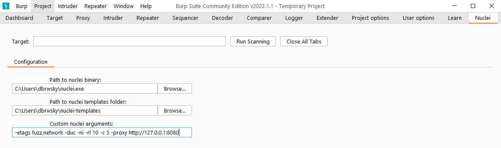
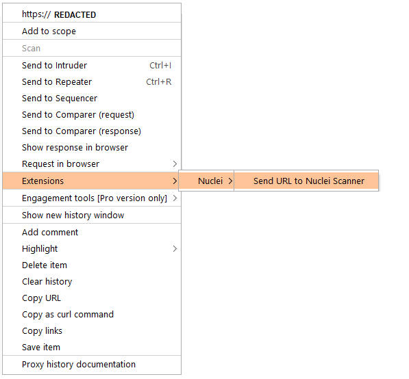
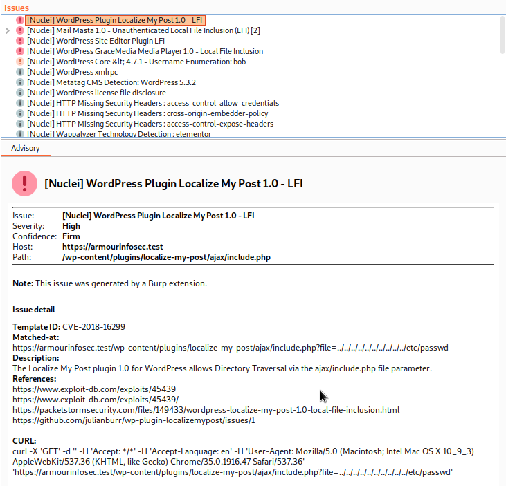
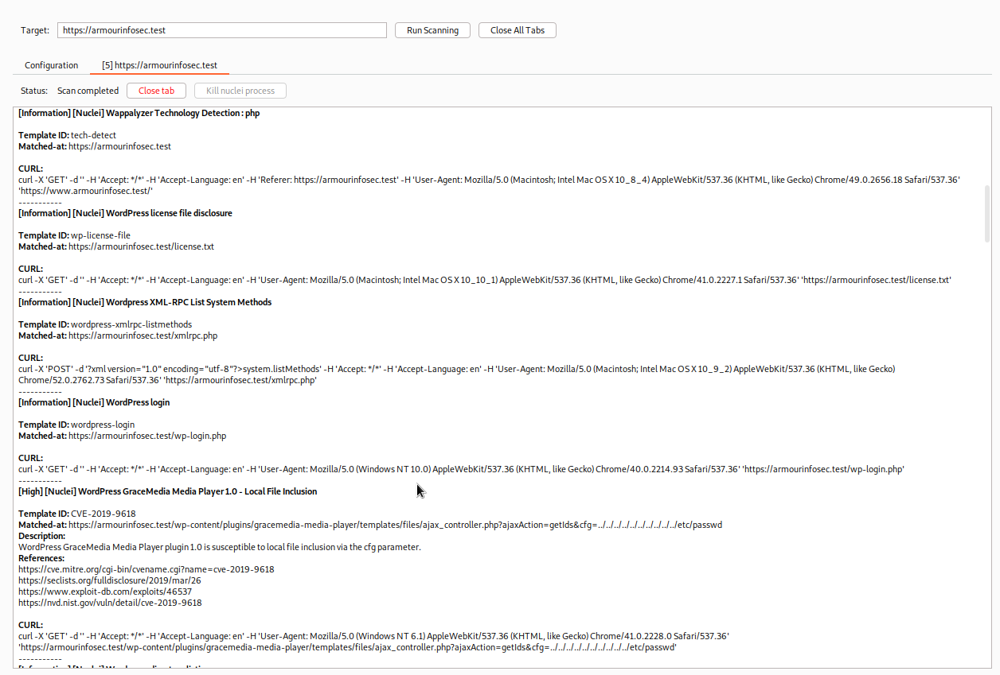

# Nuclei - Burp Extension 

Simple extension that allows to run nuclei scanner directly from burp and transforms json results into the issues.

# Installation

 - Load the extension to burp
 - Download the latest [nuclei](https://github.com/projectdiscovery/nuclei/releases) binary 
 - Download the latest [nuclei-templates](https://github.com/projectdiscovery/nuclei-templates/releases)
 - Specify the path to nuclei binary and nuclei templates in the extension configuration tab

# Usage

Specify the URL in target field or choose one from the burp history and just Run Scanning.

Nuclei templates with the network tag should be disabled for the extension to work properly. 

# Results

If you have Burp Professional then the nuclei findings will be added to the issue tab.

The results are also available in the extension tab.

